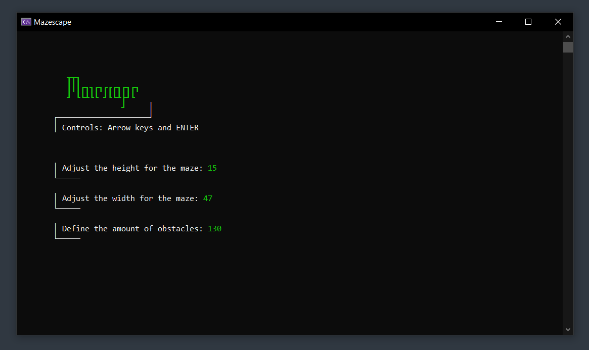
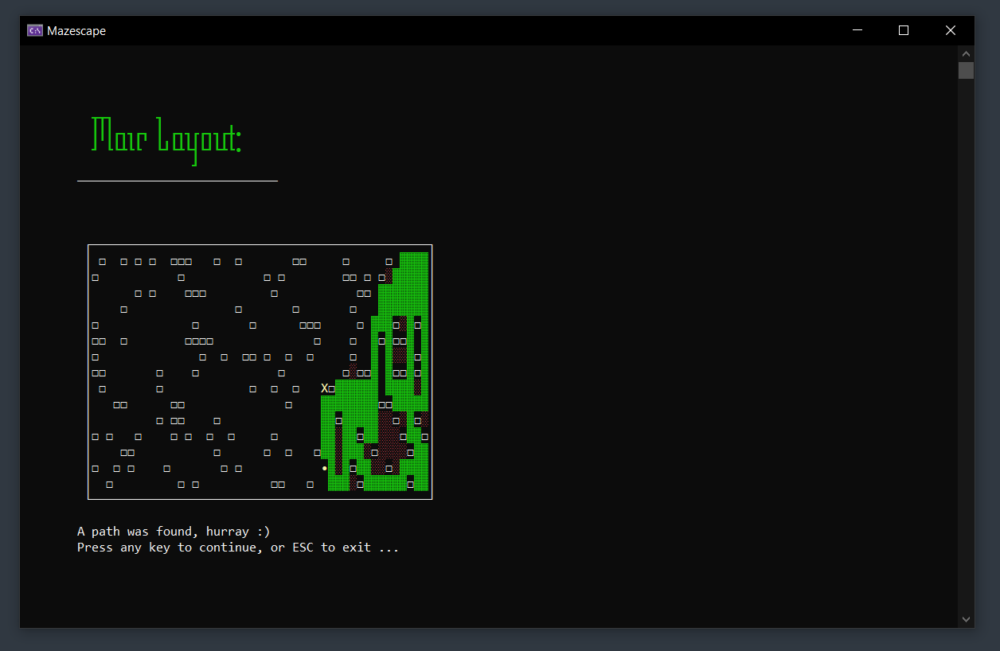

<br>

<h1 align="center">
  Mazescape
</h1>

---

Maze-Escape is a project for testing the use of recursive methods and creating a path finding algorithm.

---

## Other services used
- The website [patorjk.com](https://patorjk.com/software/taag/#p=display&f=Tmplr) was used for creating headers within the application.

## How it Works

- User of the application enters a height and width of the maze.
- Additionally the user can choose to add obstacles.
- After the input validation, the new maze will be initialized.
- At last the implemented algorithm gives a real-time visualization on finding a path.
- After the visualization finished, the user can decide to quit or create a new maze.

## Default layout characters
- ' ' -> empty space
- '**?**' -> obstacle
- '**?**' -> failed path
- '**?**' -> successful path
- '**•**' -> Start location
- '**X**' -> Destination

## How to Run

1. Clone this repository:
   ```bash git clone https://github.com/mLoDar/Mazescape.git```

2. Open the solution file `(.sln)` in Visual Studio.

3. Build the project and run it.

## Screenshots

<p align="center">
    
    <br>
    <br>
    
</p>

## Future Improvements

- [ ] Improve current path finding algorithm
- [ ] Add new algorithm to find a faster/shorter path
   
---

<p align="center">
    <i>
        Feel free to submit pull requests or issues!
    </i>
</p>
